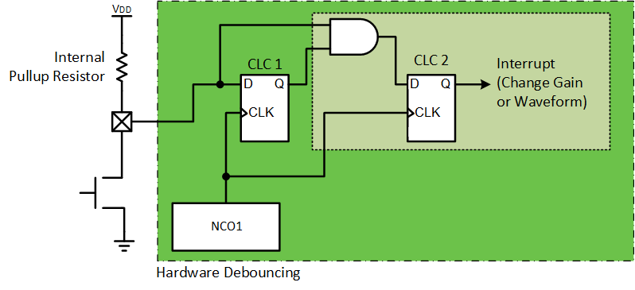

<!-- Please do not change this logo with link -->

[](https://www.microchip.com)

# Simple Oscilloscope with PIC18F56Q71

In this code example, the PIC18F56Q71 microcontroller will be used to implement a simple oscilloscope with the Operational Amplifier (OPAMP), Analog-to-Digital Converter with Computation and Context (ADCCC), Direct Memory Access (DMA), and UART peripherals. An Arbitary Waveform Generator (AWG) was also implemented for demo mode using the 10-bit Digital-to-Analog Converter (DAC) and other peripherals on the device.

## Related Examples

- [Analog Serial Read for PIC18F16Q41](https://github.com/microchip-pic-avr-examples/pic18f16q41-analog-serial-read-mplab-mcc)

## Software Used

- [MPLAB® X IDE 6.0.5 or newer](https://www.microchip.com/en-us/tools-resources/develop/mplab-x-ide?utm_source=GitHub&utm_medium=TextLink&utm_campaign=MCU8_MMTCha_pic18q71&utm_content=pic18f56q71-simple-oscilloscope-github)
- [MPLAB XC8 2.40.0 or newer compiler](https://www.microchip.com/en-us/tools-resources/develop/mplab-xc-compilers?utm_source=GitHub&utm_medium=TextLink&utm_campaign=MCU8_MMTCha_pic18q71&utm_content=pic18f56q71-simple-oscilloscope-github)
- [MPLAB Code Configurator](https://www.microchip.com/en-us/tools-resources/configure/mplab-code-configurator?utm_source=GitHub&utm_medium=TextLink&utm_campaign=MCU8_MMTCha_pic18q71&utm_content=pic18f56q71-simple-oscilloscope-github)
- PIC18F-Q_DFP v1.15.360

## Hardware Used

- PIC18F56Q71 Curiosity Nano

## Warning

**This demo does not contain any protection circuits!** NEVER apply a voltage outside of the absolute maximum ratings to the input, as this may damage or destroy the microcontroller, the Curiosity Nano, AND/OR the connected computer. Additionally, applying high voltages to the board will also present a shock hazard to the user. 

**Excerise caution when connecting this board to external circuits.**

## Setup

### I/O Utilization

**Important: Wait until the board is powered BEFORE applying input signals.**

All signals (excl. analog input) are connected on the Curosity Nano without modifications.

| Pin | Function
| --- | ---------
| RA0 | Pushbutton (SW0)
| RB1 | Analog Input (non-demo mode)
| RB4 | UART TX
| RB5 | UART RX (unused, reserved)
| RC7 | Clipping Warning (LED0)

### UART Configuration

* Baud Rate: 115200 
* Data bits: 8 bits 
* Parity: None
* Stop Bits: 1 bit

### Easy Setup

1. Connect the Curiosity Nano to your computer with a USB cable
2. Download the pre-compiled hex files under the releases tab in Github  
   
3. Unzip the hex files  
     1. Select either the free or pro version - the difference is in compiler optimizations
4. Drag-and-Drop the hex file onto the Curiosity Nano drive  
  
5. Complete *Data Visualizer Setup*

### Recompiling the Project

1. Connect the Curiosity Nano to your computer with a USB cable
2. Download the source code of the project
3. Unzip the folder (.X)
4. Open MPLAB X IDE
5. File &rarr; Open Project &rarr; Select the folder (ending in .X)  
  
6. Make any changes
7. Press the arrow pointing into the microcontroller to compile and build  
  
8. Complete *Data Visualizer Setup*

### Data Visualizer Setup

1. Open MPLAB X IDE
2. Press the Data Visualizer Icon in the toolbar  
  
3. Select the COM Port of the Curiosity Nano, but DO NOT connect to it  
  
4. Change the Baud Rate to 115,200  
  
5. Connect to the Curiosity Nano  
  
6. On the right side of the graph, click "No Source" and select the COM port  
  
7. Press the ≫ arrow in the middle of the graph to start data scroll (appears on hover)  
  
8. Data should start to populate on the graph

**By default, the example starts in demo mode, where analog waveforms are generated on device.**  


## Theory of Operation


### Basic Oscilloscope

Fundementally, the core of an oscilloscope is a fast ADC that sends data to a co-processor, which displays or stores the data for the user. To keep signals clean at high sampling rates, oscilloscopes contain an Analog Front End (AFE) which filters, attenuates and/or amplifies the input signal before it reaches the ADC.

This example follows a similiar logic to the full benchtop equipment, but at a slower speed. The AFE in this example is one of the OPAMPs on the microcontroller. An internal resistor ladder is built-in to set the gain of the OPAMP without any external components. The gain can be changed at runtime to enable a wider dynamic input range than is achievable with a fixed gain.

Note: For simplicity, this demo only implements gains of 1x, 2x, 4x, 8x and 16x. Once 16x is reached, the gain is looped back to 1x. 

The bandwidth in this example is limited by the speed of data transmission. To send a single result of data, it takes 10 bits of data; 8 data bits, no parity, 1 stop bit, and 1 start bit. At 115,200 baud, this equates to 11,520 samples per second. Due to the Nyquist-Shannon sampling theorem, the maximum frequency of a waveform that can be displayed is half the number of samples collected (e.g.: 2 points per sample). This works out to an analog bandwidth of 5.76 kHz. (Although, it is strongly recommended to run much below this to reduce signal distrotion on the display.)

To send data as fast as possible, a channel of DMA is used to grab the last result from the ADCCC and to load it automatically into the UART transmit buffer to go to the user's computer for display. To maximize bandwidth, only the 8 MSBs are sent, with the 4 LSBs from the result being discarded. 

### Clipping Detector

Using the computation functions of the ADCCC, this example can also detect when a sample is in danger of exceeding the measurement range of the ADCCC. Whenever the ADCCC measures a result, some basic calculation and evaluation operations are automatically performed by the hardware peripheral. In this case, the peripheral has been configured to check and see if the result is above 90% of the input range.

If this is true, a bit is set in an internal register. Every ADC conversion triggers an interrupt to see if the clipping indicator (LED0) should be turned on. 

### Arbitrary Waveform Generator (AWG)

For the demo/test pattern, a simple AWG was implemented on the microcontroller. The AWG signal from DAC1 is selected from the positive channel select which multiplexes various analog inputs to the OPAMP. DAC1 is configured to generate SINE, triangle, sawtooth, and square waves.

DAC1's value is set in two ways. When in SINE mode, DAC1 is automatically set to the next value in the sine table via a DMA transfer on Timer 4's signal. In the other waveform modes, the CPU performs simple compuatations and loads the value manually on the Timer interrupt.

### Button Debouncing

To change gain or waveform (depending on the mode), the pushbutton on the Curiosity Nano is debounced in hardware, as shown below.



CLC1 is synchronizes the input signal to the NCO's low frequency output. Then, CLC2 loads the logical-AND of that synchronized value and the raw input. If both are "1", then "1" is loaded into CLC2's flip-flop.

## Operation

### Demo Mode (Default)

In demo mode, the operational amplifier input is the AWG signal from the DAC. Each time the pushbutton (SW0) is pressed, the pattern switches from Sine &rarr; Triangle &rarr; Sawtooth &rarr; Square. After square, the waveform is reset to Sine. 

### Analog Input Mode

**Warning: Keep input voltages within absolute maximum limits.**

In analog input mode, the operational amplifier input is an external signal applied to an I/O pin. By default, the Curiosity Nano runs at 3.3V, which limits input signals to range of GND to 3.3V. 

Each time the pushbutton (SW0) is pressed, the gain of the operational amplifier increases (up-to 16x). The gains are 1x &rarr; 2x &rarr; 4x &rarr; 8x &rarr; 16x. When 16x is reached, the next gain will be 1x.

### Switching Modes

To switch to analog input mode, in **main.c**, undefine the macro

```
//If defined, the system is in demo mode
#define OSCILLOSCOPE_DEMO_MODE
```

If defined, the system will run in demo mode. 

## Improvements

### Faster Data Transmissions

To improve analog bandwidth, a different means of transmitting data is required. The best choice to replace UART would be SPI, which has a much higher operating frequency (in the MHz range). 

### Analog Filtering

Another improvement would be to add an analog filter to the inputs. Above the analog bandwidth are sampling aliases, which are undesired. 

## Summary

This example has shown how to create a simple oscilloscope with the PIC18F56Q71 microcontroller on a Curiosity Nano.